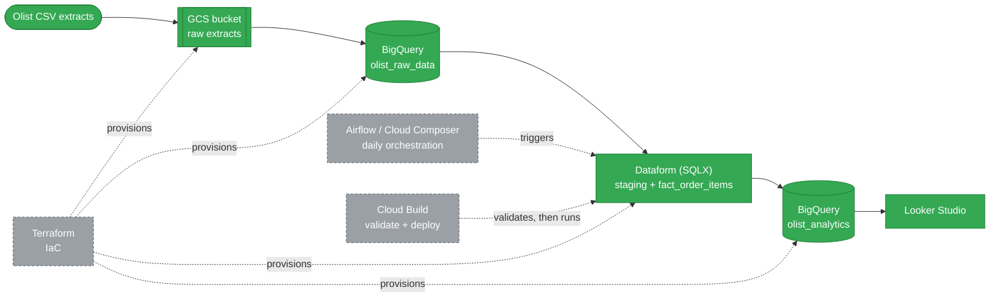

# Phase 3: Production Cloud ELT Pipeline (GCP & Looker Studio)

[-lightgrey?logo=apacheairflow)](https://airflow.apache.org/)
[-844FBA?logo=terraform)](https://www.terraform.io/)
[-blue?logo=googlecloud)](https://cloud.google.com/build)

> **The final phase of the Olist Trilogy: A production-ready Cloud infrastructure focused on scalability, automation, and cost-efficiency.**

---

## 🔄 The Olist Data Journey
This project is the culmination of a 3-part series demonstrating my growth from local scripts to enterprise cloud architecture:
1. **[Phase 1: Python/SQL Foundation](https://github.com/ZinelabidineCh/olist-python-sql-foundation)** (Local EDA & Scripting)
2. **[Phase 2: Strategic BI Dashboard](https://github.com/ZinelabidineCh/olist-bi-powerbi-analytics)** (Data Modeling & Power BI)
3. **Phase 3: Production Cloud Pipeline** (GCP Infrastructure)

---

## 🏗️ Architecture & Tech Stack
Unlike previous phases, this architecture moves away from manual execution to a **Modern Data Stack (MDS)** approach: ingestion, transformation, orchestration and deployment are all defined as code.

*Solid arrows = the running ELT path. Dashed arrows = the orchestration/IaC/CI-CD layer described in [Extension: Orchestration, IaC & CI/CD](#-extension-orchestration-iac--cicd) below — grey nodes are designed, not yet running against live infra (see that section for what's actually been tested).*

* **Ingestion:** Raw CSV data stored in **Google Cloud Storage (GCS)**.
* **Storage:** **Google BigQuery** (Multi-tier: `olist_raw_data` for staging and `olist_analytics` for production).
* **Transformation:** **Dataform (SQLX)** for modular ELT and dependency management.
* **Orchestration:** **Airflow / Cloud Composer** DAG scheduling the Dataform runs *(design)*.
* **Infrastructure as Code:** **Terraform** provisioning the GCS bucket, BigQuery datasets, Dataform repository and IAM *(design)*.
* **CI/CD:** **Cloud Build** validating SQLX compilation and deploying on push *(validate stage tested, deploy stage design)*.
* **Optimization:** Advanced Table Partitioning and Clustering for performance.
* **Visualization:** **Looker Studio** for real-time cloud-native reporting.

---

## 🛠️ Dataform Workflow & Lineage
Using Dataform allowed me to treat data transformations like software code (Version Control + Testing):

1.  **Staging Layer:** Cleaned raw strings, cast types (Prices to `FLOAT64`, Dates to `TIMESTAMP`), and standardized schema names.
2.  **Quality Control:** Integrated **Dataform Assertions** (Unit Tests) to verify that critical columns like `order_id` were unique and non-null before reaching the Analytics layer.
3.  **Analytics Layer:** Joined multiple sources into a centralized, high-performance `fact_order_items` table.

---

## 🧭 Extension: Orchestration, IaC & CI/CD

Beyond the Dataform pipeline itself, this repo includes a **design layer** for how it would be operated as a real freelance-delivered platform: scheduled orchestration, infrastructure as code, and a validating deploy pipeline. This layer is built and documented in the open specifically because orchestration and IaC are the parts junior GCP roles rarely get hands-on with — being explicit about what's proven vs. designed is more useful to a prospective client than presenting an unrun production setup as if it were live.

### 🗓️ Orchestration — Airflow ([`orchestration/`](./orchestration/))
[`dataform_orchestration_dag.py`](./orchestration/dataform_orchestration_dag.py) orchestrates the Dataform repository on a daily schedule using the real `apache-airflow-providers-google` Dataform operators (`DataformCreateCompilationResultOperator`, `DataformCreateWorkflowInvocationOperator`, `DataformWorkflowInvocationStateSensor`) — the same operators you'd use against a live Cloud Composer environment.
* **Status: syntax-consistent with the provider's documented API, not executed against a real Composer environment.** There's no Composer environment provisioned for this portfolio project (cost). Presented as a design reference, not as something running in production.

### 🏗️ Infrastructure as Code — Terraform ([`terraform/`](./terraform/))
Provisions the pipeline's GCP footprint declaratively: the raw-data GCS bucket, the two BigQuery datasets (`olist_raw_data`, `olist_analytics`), the managed Dataform repository (linked to this GitHub repo), and IAM — two purpose-built service accounts (Airflow, Cloud Build) scoped to the Dataform repository only, plus dataset-level (not project-level) BigQuery access for the Dataform Service Agent.
* **Status: written against the `hashicorp/google` provider schema, not `terraform apply`-ed.** No `terraform` binary was available in the authoring environment to run `init/plan/apply`, and applying against a real project is a billed action left for you (or me, with your go-ahead) to run deliberately. See [`terraform/README.md`](./terraform/README.md) for the two manual bootstrap steps (GitHub PAT secret, Cloud Build GitHub App install) IaC can't fully automate on its own.

### 🔁 CI/CD — Cloud Build ([`cloudbuild.yaml`](./cloudbuild.yaml))
A two-stage pipeline triggered on push to the default branch:
1. **Validate** — installs `@dataform/cli` and runs `dataform compile` against `definitions/`, failing fast on a bad `ref()` or config block, before anything touches BigQuery.
2. **Deploy & run** — asks the managed Dataform repository to compile the pushed commit and creates a workflow invocation, i.e. actually executes the staging tables + incremental `fact_order_items` build, assertions included.
* **Status: the validate stage has actually been run** locally against this repo's real `definitions/` (`dataform compile` → 9 actions compiled, 4 datasets, 5 assertions, 0 errors). **The deploy stage and the trigger itself are untested** — no live Cloud Build trigger is provisioned for this portfolio project.

---

## ⚡ Performance & Cost Optimization
In a cloud environment, efficiency equals savings. I implemented:
* **Partitioning:** The `fact_order_items` table is partitioned by `purchase_at` (Day), reducing query costs by up to 90% when filtering by date.
* **Clustering:** Data is clustered by `product_category_name`, ensuring that Looker Studio filters respond instantly.

---

## 📊 Business Insights (Looker Studio)
The final dashboard provides a real-time, cloud-connected view of:
* **Financials:** Total Revenue, Average Order Value (AOV), and Sales Volume.
* **Trends:** Monthly revenue evolution tracking growth patterns.
* **Category Analysis:** Identification of top-performing product segments.

---

## 🛠️ Troubleshooting & Technical Challenges

### 1. Data Type Mismatch (The "String" Trap)
* **Issue:** Raw ingestion into BigQuery defaulted all columns to `STRING`, breaking mathematical aggregations.
* **Solution:** Implemented explicit `CAST` functions in the Dataform staging layer.
* **Impact:** Restored the ability to perform financial calculations (Revenue, Growth %).

### 2. Dashboard Aesthetic & Metric Accuracy
* **Issue:** Initial scorecards showed confusing decimal places (e.g., "271.0" orders) and lacked currency context.
* **Solution:** Normalized decimal precision to `0` for counts and applied **BRL Currency formatting** for financial KPIs.

### 3. Dataform Dependency Management
* **Issue:** Tables frequently failed during execution because they attempted to populate before the source tables existed.
* **Solution:** Used the `ref()` function in SQLX to build a **Directed Acyclic Graph (DAG)**, ensuring a perfect execution sequence.

### 4. BigQuery Cost & Performance Optimization
* **Issue:** Standard queries on large datasets can be expensive if they scan the whole table every time.
* **Solution:** Implemented **Partitioning** on the `purchase_at` column. This forces BigQuery to only scan the specific data "shards" requested by the Looker Studio date filter.

---
*Author: Zinelabidine Chiguer*
